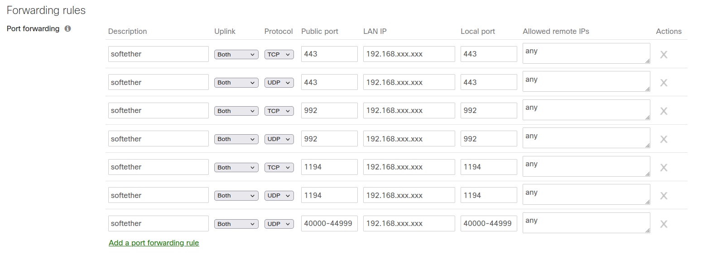

## ポート開放の設定

構築した SoftEther VPN Server に外部から接続するためには、ルータにて以下のポートを開放する必要があります。

* TCP, UDP: 443, 992, 1194
	* SoftEther VPN 独自プロトコル, SSTP, OpenVPN 等のプロトコルで使用します。

* UDP: 40000-44999
	* SoftEther VPN 独自プロトコル: UDP 高速化機能で使用します。

例として、Cisco Meraki での設定方法を記載します。

次のスクリーンショットのように設定してください。なお、LAN IP には構築した SoftEther VPN Server の IP アドレスを記載してください。

